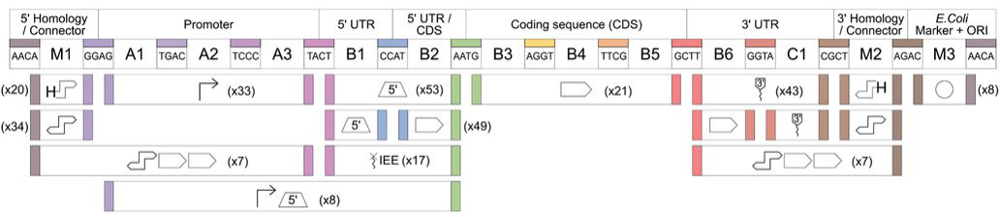

# Advancing chloroplast synthetic biology through high-throughput plastome engineering of *Chlamydomonas reinhardtii*

## Abstract
Chloroplast synthetic biology holds promise for advancing photosynthetic organisms through improving the function of plastids. However, chloroplast engineering efforts face limitations due to the scarcity of genetic tools and the low throughput of plant-based systems. To address these challenges, we here established Chlamydomonas reinhardtii as a prototyping chassis for chloroplast synthetic biology. To that end, we developed an automation workflow that enables the generation, handling, and analysis of thousands of transplastomic strains in parallel. Furthermore, we expanded the repertoire of effective selection markers and reporter genes, and characterized over 140 regulatory parts, including native and synthetic promoters, 5’ and 3’ untranslated regions (UTRs), as well as intercistronic expression elements. We integrated the system within existing molecular cloning (MoClo) standards and demonstrated several applications, including a library-based approach to develop synthetic promoter designs in plastids. Finally, we also provide a proof-of-concept for prototyping metabolic pathways in plastids by introducing a chloroplast-based synthetic photorespiration pathway, resulting in a threefold increase in biomass production. Overall, our study advances current chloroplast engineering efforts by providing a high-throughput platform and standardized genetic parts for the rapid prototyping and characterization of plastid manipulations with the prospect of high transferability between different chloroplasts, including those of higher plants and crops.   



## Overview

### Data
Contains source data underlying the main-text figures (and extended/source data where applicable).  
More information on each file can be found [here](https://github.com/ChlamyMarburg/ChloroplastTools/blob/main/data/README.md).

### Parts
Contains the manual for our chloroplast modular cloning system and the curated parts library:  
➡️ **Start here**: [parts/README.md](https://github.com/ChlamyMarburg/ChloroplastTools/blob/main/parts/README.md)

Subfolders contain individual `GenBank` files for the following sequences/parts/constructs:
- **Overhangs**  
  > Defined overhangs for each part type, in both `forward` and `reverse` orientations.
- **pME_Cp_0**  
  > MoClo level-0 parts, organized by part type (promoters, UTRs, CDS/tags, IEEs, terminators, backbones).
- **pME_Cp_2**  
  > MoClo level-2 constructs used in this publication, primarily measurement constructs.
- **pME_Cp_E**  
  > Universal acceptor vectors for MoClo assemblies.

### Pipeline
Contains automation workflows for generating, handling, and analysing thousands of transplastomic strains in parallel. The pipeline is split into two main parts:
1. **Measurement**  
   > Uses OD measurements from a Tecan plate reader and auto-generates an [Echo acoustic pipetting robot](https://www.beckman.de/liquid-handlers/echo-525) script for dilutions and downstream measurement setup.
2. **Processing**  
   > Combines OD and luminescence measurements and, based on the previously generated Echo script, automatically maps parts to measurements and performs normalization.

*Note*: If you intend to use the pipeline, install the required dependencies listed in `pyproject.toml`. Before running the script, make sure to edit the corresponding `config.py`.

## Citation
Cite [this work](https://doi.org/10.1101/2024.05.08.593163)
```bibtex
@article{ChlamyMoClo,
  title = {Advancing chloroplast synthetic biology through high-throughput plastome engineering of Chlamydomonas reinhardtii},
  url = {http://dx.doi.org/10.1101/2024.05.08.593163},
  DOI = {10.1101/2024.05.08.593163},
  author = {Inckemann,  René and Chotel,  Tanguy and Burgis,  Michael and Brinkmann,  Cedric K. and Andreas,  Laura and Baumann,  Jessica and Sharma,  Priyati and Klose,  Melanie and Barrett,  James and Ries,  Fabian and Paczia,  Nicole and Glatter,  Timo and Willmund,  Felix and Mackinder,  Luke C. M. and Erb,  Tobias J.},
}
```


