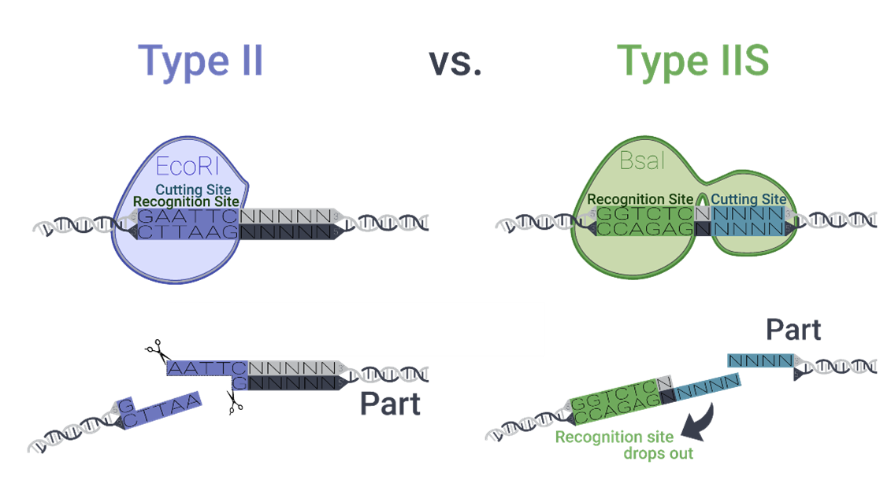

# Manual for the Chloroplast Modular Cloning System

## Type IIs restriction enzymes
Unlike conventional Type II restriction enzymes, which cleave DNA within their recognition sequences, Type IIS restriction enzymes cut outside their recognition sequences at defined distances (Figure 1) This property allows for the flexible design of overhangs, enabling a single enzyme to generate up to 256 distinct 4-base pair overhangs. This capability has led to the development of the Golden Gate cloning technique, now one of the most widely used cloning methods. Commonly used Type IIS enzymes include BsaI, BsmBI, BpiI (BbsI), PaqCI (AarI), and SapI.

*<b>Figure 1</b> General principle of Type IIs restriction enzymes. While Type II restriction enzymes cleave DNA within their recognition sequence, Type IIS restriction enzymes cut DNA adjacent to their recognition sites, allowing the 4-base pair cut site to be freely chosen.*
