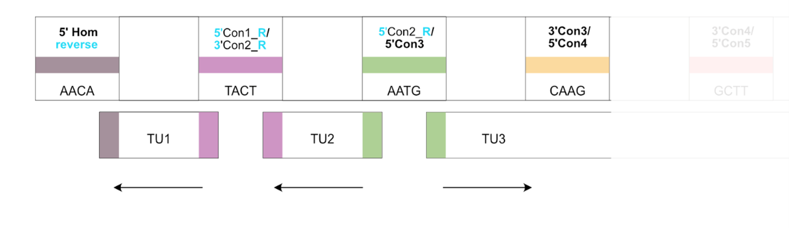

# Manual for the Chloroplast Modular Cloning System

# Table of Contents
* [Type IIs restriction enzymes](#type-iis-restriction-enzymes)
* [General Introduction](#general-introduction)
* [The general Modular cloning scheme](#the-general-modular-cloning-scheme)
* [Domesticating new Level 0 parts](#domesticating-new-level-0-parts)
* [Assembly of Level 1 Transcription Units](#assembly-of-level-1-transcription-units)

## Type IIs restriction enzymes

Unlike conventional Type II restriction enzymes, which cleave DNA within their recognition sequences, Type IIS restriction enzymes cut outside their recognition sequences at defined distances (Figure 1). This property allows for the flexible design of overhangs, enabling a single enzyme to generate up to 256 distinct 4-base pair overhangs. This capability has led to the development of the Golden Gate cloning technique, now one of the most widely used cloning methods. Commonly used Type IIS enzymes include BsaI, BsmBI, BpiI (BbsI), PaqCI (AarI), and SapI.

 

<html>
<figure>
    
    <figcaption>
<b>Figure 1</b> General principle of Type IIs restriction enzymes 
While Type II restriction enzymes cleave DNA within their recognition sequence, Type IIS restriction enzymes cut DNA adjacent to their recognition sites, allowing the 4-base pair cut site to be freely chosen. </figcaption>
</figure>
</html>
  

Golden Gate cloning allows these enzymes to be combined in a single "one-pot" reaction with T4 ligase, eliminating the need for separate restriction and ligation steps. Because the recognition sites for Type IIS enzymes are cleaved off during digestion and are not included in the final assembly (Figure 1), correctly assembled constructs are not cleaved further. This feature enables the cycling of restriction enzyme digestion and ligation steps, which increases the efficiency of obtaining correctly assembled constructs.

 

## General introduction

Following the initial development of Golden Gate cloning and the subsequent creation of the widely adopted Modular Cloning (MoClo) standard syntax, which employs standardized overhangs generated by Type IIS restriction enzymes such as BsaI, BpiI, and BsmBI, a consensus has emerged within the plant synthetic biology community. 
The widely adopted Phytobrick standard in the plant synthetic biology community has been successfully adapted for a range of photosynthetic organisms, including cyanobacteria, plants, mosses, plant chloroplasts, and even for nuclear engineering in Chlamydomonas.
To apply synthetic biology techniques to chloroplast engineering in Chlamydomonas reinhardtii, standardizing and characterizing genetic parts is essential. Although different cloning systems employ varying strategies for assembling multigene constructs, most are compatible with the assembly of single transcription units from standardized parts. Our system, utilizes a hierarchical assembly approach, similar to the common Plant MoClo and the Chlamydomonas MoClo system, rather than the iterative cloning scheme used in the GoldenBraid/Loop assembly standard.

The following sections provide a detailed explanation of our cloning system.

 

## The general Modular cloning scheme

In our hierarchical cloning scheme, individual Level 0 parts are first cloned into a universal acceptor vector. A Level 0 part represents the DNA sequence of a fundamental genetic element—such as a promoter, 5’UTR, coding sequence, or 3’UTR—flanked by a standardized 4-bp overhang and BsaI recognition sites.

 

<html>
<figure>
    
    <figcaption>
<b>Figure 2</b> The hierarchical modular cloning scheme 
New parts are first domesticated and assembled into a universal acceptor vector (Level 0). These parts can then be combined in a one-pot reaction to create Level 1 plasmid containing a single transcriptional unit. Optionally, these single transcriptional units can be further assembled into a multigene cassette (Level 2).</figcaption>
</figure>
</html>
  

These parts are then assembled into a single transcriptional unit using a one-pot Golden Gate reaction with BsaI, combining 5–9 Level 0 parts into a Level 1 assembly. 

Next, 2–7 transcriptional units are integrated into a Level 2 multigene cassette via another one-pot Golden Gate reaction using BsmBI. In our system, the arrangement and order of transcription units are defined by the chosen connectors (detailed explanation below), rather than by the acceptor vectors used in the Level 1 assembly.

To enable selection of successfully assembled plasmids, different antibiotic markers are used at each assembly stage. In our system, Level 0 employs chloramphenicol, Level 1 uses carbenicillin (or ampicillin), and Level 2 utilizes kanamycin selection.

 

## Domesticating new Level 0 parts

New Level 0 parts are generated using PCR products or synthesized DNA. These linear sequences are then assembled into a single standardized universal acceptor vector. 
In contrast to other methods that require multiple acceptor vectors, only one is needed because standardized overhangs are incorporated into the PCR primers or synthesized sequence. The specific overhangs are detailed in Table 1.

 

<html>
<figure>
    
    <figcaption>
<b>Figure 3</b> Domesticating new Level 0 Parts  
PCR or DNA synthesis fragments that include standardized overhangs and BsmBI recognition sites are assembled into the Universal Acceptor vector. This vector features an mScarlet placeholder, enabling pink/white colony screening.</figcaption>
</figure>
</html>
  

The unique overhangs assign the position within the Level 1 assembly for the subsequent cloning steps. For some overhangs, additional nucleotides are appended. For example, overhangs in the 3’UTR position ($${\color{blue}{\text{GCTT}}\color{green}{\text{AA}}},{\color{blue}{\text{GGTA}}\color{green}{\text{A}}}$$) incorporate stop codons, while those at the tag positions ($${\color{blue}{\text{CCAT}}\color{green}{\text{G}},\color{green}{\text{GG}}\color{blue}{\text{AATG}},{\color{blue}{\text{GCTT}}\color{green}{\text{TA}}}}$$) include extra bases to ensure that fusion tags remain in frame.

For the domestication of new coding sequences, the original start and stop codons are removed. The start codon is reintroduced as part of the Golden Gate overhang for the CDS, which prevents double start codons, while the stop codon is incorporated into the 3’UTR/terminator sequence. This design allows for the modular addition of C-terminal tags.

For most Level 0 assemblies, the BsmBI enzyme is used. However, for new Connector/Integration site homology parts, the enzyme PaqCI is required along with the alternative Universal acceptor vector (pME_G_E_007_UAV_sfGFP_PaqCI). This is because these parts contain BsmBI recognition sites, which are necessary for the subsequent assembly of multi-gene constructs.

 

| Position | Sequence |
|:------|:-----|
| 1_5'Homology_Connector_fwd | $$\text{AA}{\color{orange}{\text{CACCTGC}}}\text{ATATCTCG}{\color{blue}{\text{AACA}}}{\color{brown}{\text{CGTCTC}}}\text{GNNNN}$$ |
| 1_5'Homology_Connector_rv              | $${\color{blue}{\text{GGAG}}}\text{TGAGATAT}{\color{orange}{\text{GCAGGTG}}}\text{TT}$$             |
| 2_Promoter_fwd                | $$\text{AA}{\color{brown}{\text{CGTCTC}}}\text{GCTCG}{\color{blue}{\text{GGAG}}}$$              |
| 2_Promoter_rv                 | $${\color{blue}{\text{TACT}}}\text{TGAGG}{\color{brown}{\text{GAGACG}}}\text{AA}$$                    |
| 3_5'UTR_fwd                   | $$\text{AA}{\color{brown}{\text{CGTCTC}}}\text{GCTCG}{\color{blue}{\text{TACT}}}$$                    |
| 3_5'UTR_rv                    | $${\color{blue}{\text{AATG}}}\text{TGAGG}{\color{brown}{\text{GAGACG}}}\text{AA}$$                    |
| 3a_5'UTR_fwd                  | $$\text{AA}{\color{brown}{\text{CGTCTC}}}\text{GCTCG}{\color{blue}{\text{TACT}}}$$                   |
| 3a_5'UTR_rv                   | $${\color{blue}{\text{CCAT}}}\text{TGAGG}{\color{brown}{\text{GAGACG}}}\text{AA}$$                    |
| 3b_N-tag_fwd                  |   $$\text{AA}{\color{brown}{\text{CGTCTC}}}\text{GCTCG}{\color{blue}{\text{CCAT}}}{\color{green}{\text{G}}}$$             |
| 3b_N-tag_rv                   | $${\color{green}{\text{GG}}}{\color{blue}{\text{AATG}}}\text{TGAGG}{\color{brown}{\text{GAGACG}}}\text{AA}$$              |
| 4_CDS_fwd                     | $$\text{AA}{\color{brown}{\text{CGTCTC}}}\text{GCTCG}{\color{blue}{\text{AATG}}}$$                    |
| 4_CDS_rv                      | $${\color{blue}{\text{GCTT}}}\text{TGAGG}{\color{brown}{\text{GAGACG}}}\text{AA}$$                   |
| 5_3'UTR+Terminator_fwd        | $$\text{AA}{\color{brown}{\text{CGTCTC}}}\text{GCTCG}{\color{blue}{\text{GCTT}}}{\color{green}{\text{AA}}}$$              |
| 5_3'UTR+Terminator_rv         | $${\color{blue}{\text{CGCT}}}\text{TGAGG}{\color{brown}{\text{GAGACG}}}\text{AA}$$                    |
| 5a_C-tag_fwd                  | $$\text{AA}{\color{brown}{\text{CGTCTC}}}\text{GCTCG}{\color{blue}{\text{GCTT}}}{\color{green}{\text{TA}}}$$              |
| 5a_C-tag_rv                   | $${\color{blue}{\text{GGTA}}}\text{TGAGG}{\color{brown}{\text{GAGACG}}}\text{AA}$$                   |
| 5b_3'UTR+Terminator_fwd       | $$\text{AA}{\color{brown}{\text{CGTCTC}}}\text{GCTCG}{\color{blue}{\text{GGTA}}}{\color{green}{\text{A}}}$$              |
| 5b_3'UTR+Terminator_rv        | $${\color{blue}{\text{CGCT}}}\text{TGAGG}{\color{brown}{\text{GAGACG}}}\text{AA}$$                    |
| 6_3'Homology_Connector_fwd             | $$\text{AA}{\color{orange}{\text{CACCTGC}}}\text{ATATCTCG}{\color{blue}{\text{CGCT}}}$$                |
| 6_3'Homology_Connector_rv              | $$\text{NNNNG}{\color{brown}{\text{GAGACG}}}{\color{blue}{\text{AGAC}}}\text{TGAGATAT}{\color{orange}{\text{GCAGGTG}}}\text{TT}$$ |
| 7-8_E.coli_ORI-Resistance_fwd | $$\text{AA}{\color{brown}{\text{CGTCTC}}}\text{GCTCG}{\color{blue}{\text{AGAC}}}$$                    |
| 7-8_E.coli_ORI-Resistance_rv  | $${\color{blue}{\text{AACA}}}\text{TGAGG}{\color{brown}{\text{GAGACG}}}\text{AA}$$                   |

**Table 1** Overhangs for creating new Level 0 parts via DNA synthesis/PCR 
Level 1 overhangs are  indicated in $${\color{blue}\text{blue}}$$. BsmBI sites ($${\color{brown}{\text{CGTCTC}}}/{{\color{brown}{\text{GAGACG}}}}$$) 
are indicated in $${\color{brown}\text{brown}}$$. For connector overhangs PaqCI sites ($${\color{orange}{\text{CACCTGC}}}/{{\color{orange}{\text{GCAGGTG}}}}$$) are used and indicated in $${\color{orange}\text{orange}}$$.
 

Our version of the universally acceptor vector, allows for pink/white selection after cloning and transformation, due to the mScarlet placeholder cassette in the vector.
Except of this mScarlet placeholder cassette this vector is sequence identical to the commonly used (in the plant synthetic biology community) Universal acceptor vector:

[Addgene #68161](https://www.addgene.org/68161/)
 

Another aspect, which needs to be considered when creating new Level 0 Part is that  internal  enzyme recognition sites for at least BsaI and BsmBI have to be removed within the part sequence to not interfere with the subsequent cloning process.

## Assembly of Level 1 Transcription Units

To construct a single transcriptional unit (Level 1), 5–9 Level 0 parts are assembled in a one-pot reaction using BsaI. The overhangs on these parts adhere to the widely adopted Phytobrick standard, which is also employed in the modular cloning system for nuclear engineering in Chlamydomonas, including the A1–C1 overhangs (Figure 4).

 
<html>
<figure>
    
    <figcaption>
<b>Figure 4</b> Part types and positioning of the chloroplast modular cloning system 
The modular design of the system provides high flexibility by offering 5’UTRs, promoters, IEEs, and tags as separate, independently selectable parts. The chloroplast modular cloning systems adheres to the widely adopted Phytobrick standard, including the A1-C1 overhangs. These overhangs are complemented by two additional overhangs for the connectors/homology parts, as well as the E. coli marker and origin.</figcaption>
</figure>
</html>
  

Compared to the modular cloning system for nuclear engineering in Chlamydomonas, our system brings several new features, such as the additional connector/homology parts, the possibility of building polycistronic transcription units via IEEs and a few more. 

Our system differs from the traditional modular cloning architecture by not using the conventional Level 1 and Level 2 acceptor vectors to dictate the placement of the transcription units in subsequent assembly steps. Instead, this function is performed by connector parts that contain BsmBI sites and specific overhangs to define the arrangement of multigene constructs. The following sections provide a detailed explanation of these homology parts/connectors and other new features.

### New in our Chloroplast Modular cloning System: Chloroplast genome homology parts and connectors

To adapt the Modular Cloning (MoClo) approach for chloroplast engineering, the standard MoClo positions have been extended with additional Connector/Homology positions. These extensions enable site-directed integration into the plastome and support multigene assembly. Four specific regions of the chloroplast genome are available as homology sites for precise, site-specific integration. For multigene assemblies, the 5’ homology region is incorporated into the first transcription unit and the 3’ homology region into the last transcription unit. Alternatively, these homology parts can be used within a single transcription unit to integrate a single gene of interest.

 
<html>
<figure>
    
    <figcaption>
<b>Figure 5</b> Homology parts of the chloroplast genome of <i>Chlamydomonas reinhardtii</i> 
Chloroplast regions for four distinct integration sites are provided as homology parts within the extended Modular Cloning framework, supplementing the standard Phytobrick part positions. Notably, one homology part also includes a photosynthetic gene, which can be leveraged for photosynthetic selection strategies.</figcaption>
</figure>
</html>
  

The same modular cloning position as the homology parts (M1 and M2) are also used for the connector parts. These connector parts are used within a Level 1 assembly  to define the order of transcription units within a multigene Level 2 assembly. These parts include BsmBI sites and the different overhangs for the respective position of the transcription unit.

Our system features several types of connector parts—including short, long, and reverse connectors (detailed below). Each type comprises seven distinct connectors corresponding to the seven positions in a Level 2 multigene assembly. 

One advantage of connector-based assembly is its increased flexibility: no end linkers are required, and new functions can be easily incorporated into the connector parts. The 5’ and 3’ connectors are selected independently to construct a Level 1 plasmid, allowing one to seven Level 1 plasmids to be combined into a Level 2 plasmid without needing the end linkers that other modular cloning systems require.

To design and assemble multigene constructs, the rule for selecting connectors is as follows: 5′Con(N) connects to 3′Con(N–1). For example, the 5′ connector of the second transcription unit (5′Connector_2) must connect to the 3′ connector of the first transcription unit (3′Connector_1). Additionally, the total number of transcription units in the final assembly must be considered, since the last unit must end with 3′Homology for the integration in the chloroplast genome and to properly connect to the Level 2 backbone.

 
<html>
<figure>
    
    <figcaption>
<b>Figure 6</b> Connector parts define the position of transcription units within a multigene assembly</figcaption>
</figure>
</html>
  

## Assembly of Level 2 Multi-gene constructs

### Example for the Assembly of a Level 2 Multi-gene construct

An example of assembling a Level 2 multigene construct is as follows:

* First Transcription Unit:
+ Use a 5' Homology part for the  connector position (selectable from four   
  chloroplast integration sites)
+ Use 3' Connector 1

* Second Transcription Unit:
+ Use 5' Connector 2
+ Use 3' Connector 2

* Third Transcription Unit:
+ Use 5' Connector 3
+ Use the corresponding 3' Homology part that matches the chosen 5' Homology site

 

These three Level 1 plasmids are subsequently combined with a Level 2 acceptor vector in a BsmBI Golden Gate reaction. The connectors selected during the Level 1 assembly determine the final order of transcription units in the multigene construct.

### Additional features: Reversing of Transcription Units

Our modular cloning system also includes a set of reverse connectors that allow the orientation of transcription units to be switched. This is particularly important because natural 3′UTRs often lack strong termination signals, leading to read-through transcription. Such read-through can produce antisense RNA that interferes with the expression of neighboring genes. By inverting the direction of transcription units, this issue can be circumvented. Additionally, homology parts for plastome integration have been designed with an inversion option for all available integration sites as well.

 
<html>
<figure>
    
    <figcaption>
<b>Figure 7</b> Reverse connectors allow reverse orientation of transcription units within Level 2 assemblies</figcaption>
</figure>
</html>
  

For reverse transcription unit assembly, the same naming scheme and rules apply, with each connector number corresponding to its position in the multigene assembly. The only difference is that the reversed versions of the 5′ and 3′ connectors must be used. This approach allows the orientation of up to seven transcription units to be independently selected.

 

### Additional features: Building polycistronic operons via Intercistronic expression elements (IEEs) and operon connectors

One feature that has not traditionally been incorporated into the Modular Cloning approach is the construction of polycistronic operon structures. Standard Modular Cloning assemblies rely on separate transcription units composed of promoters, 5′UTRs, coding sequences, and 3′UTRs/terminators. To integrate polycistronic design into this framework, a method was needed to “skip” the promoter and terminator positions. This was achieved by extending the connector position to bypass these regions. In this work, 14 novel operon connectors were designed and constructed, enabling the assembly of operons with up to seven genes expressed from a single polycistronic mRNA. These new operon connector parts can be adapted for any Modular Cloning toolkit designed for bacterial chassis, thereby facilitating polycistronic expression. 

 
<html>
<figure>
    
    <figcaption>
<b>Figure 8</b> Operon connectors and IEE parts enable the construction of polycistronic multigene assemblies 
Operon parts are included in our modular cloning system to “skip” promoter and 3’UTR/Terminator positions. When combined with intercistronic expression elements (IEEs), these parts enable the assembly of polycistronic multigene constructs.</figcaption>
</figure>
</html>
  

Although polycistronic expression is native to chloroplasts due to their bacterial origin, the primary polycistronic transcript often requires post-transcriptional processing into monocistronic fragments. To implement polycistronic gene expression for chloroplast engineering, the necessary intercistronic expression elements (IEEs) were integrated into our system in place of the 5′UTR. Combined with the operon connectors described above, this design allows for the construction of modular polycistronic constructs for chloroplast expression. 
For example, a polycistronic construct can be built by designing the first transcription unit to include a promoter and a 3′ operon connector, while the second transcription unit contains a 5′ operon connector, one of 11 distinct IEE parts, and a 3′UTR. This configuration allows two genes of interest to be expressed from a single polycistronic transcript.

### Additional features: Placeholder parts

To facilitate the characterization of entire libraries of a specific part type, it would be ideal to pre-build Level 2 assemblies with a placeholder that can later be exchanged with library elements. However, exchangeable parts have not been implemented within the Modular Cloning framework. Therefore we have designed and constructed placeholder parts that can be removed after the assembly process. In standard Golden Gate cloning, the recognition sites are eliminated in the final construct; therefore, these placeholders must be designed to retain BsaI recognition sites after assembly. This was  be achieved by incorporating the reverse BsaI recognition sequence.

To simplify the identification of correct assemblies, a GFP cassette—expressed in E. coli—was selected as the placeholder. These placeholder parts have been designed and constructed for most positions defined by the standardized Phytobrick and MoClo syntax, making them universally replaceable in all MoClo toolkits that adhere to this standard.

 
<html>
<figure>
    
    <figcaption>
<b>Figure 9</b> Design and function of modular placeholder parts   
BsaI is a Type IIS restriction enzyme that cuts outside of its recognition sequence. In the standard Golden Gate cloning approach (a), the recognition site is removed during assembly. By contrast, using the reverse BsaI recognition sequence (b) allows the site to remain in the final construct. This retained recognition site enables the design of placeholder parts that can be removed in subsequent cloning rounds.</figcaption>
</figure>
</html>
  

The placeholder parts are treated as regular parts during the Golden Gate assembly, with only a minor protocol adjustment required: the final step in the thermocycler should be a 16°C ligation step. Without this step, the placeholder would be excised from the assembled plasmid. Once assembled, colonies can be identified by green fluorescence due to the GFP cassette. The resulting Level 2 plasmid can then be used for the insertion of part libraries at the placeholder position.

