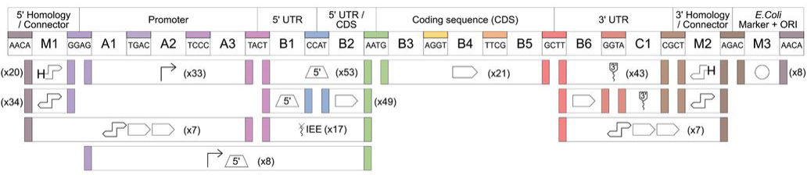

# LVL-0 GoldenGate Parts

## Overview

## Nomenclature
| Nomenclature | Position | Part Type | Description | Left Overhang | Right Overhang | 
|--------------|----------|-----------|-------------|---------------|----------------|
| pME_Cp_0_1 | M1 | 5'Homology/Connector | determines TU position and orientation | AACA | GGAG | 
| pME_Cp_0_1-2 | M1-A3 | 5' Operon Connector | used for assembling polycistrons | AACA | TACT |
| pME_Cp_0_2 | A1-A3 | Promoter | Promoter position | GGAG | TACT |
| pME_Cp_0_2-3 | A1-B2 | Promoter - 5'UTR | Promoter - 5' UTR fusions | GGAG | AATG |
| pME_Cp_0_3 | B1-B2 | 5'UTR | 5'UTR position | TACT | AATG |
| pME_Cp_0_3_IEE | B1-B2 | IEE | intercistronic expression element used to assemble polycistronic constructs | TACT | AATG |
| pME_Cp_0_3a | B1 | 5'UTR | 5'UTR for use with N-tags | TACT | CCAT |
| pME_Cp_0_3b | B2 | N-tags | N-tags with start codon included | CCAT | AATG |
| pME_Cp_0_4 | B3-B5 | CDS | Coding sequence position | AATG | GCTT |
| pME_Cp_0_5 | B6-C1 | 3'UTR | 3'UTR position (includes stop codon) | GCTT | CGCT |
| pME_Cp_0_5-6 | B6-M2 | 3' Operon Connector | used for assembling polycistrons | GCTT | AGAC |
| pME_Cp_0_5a | B6 | C-tag | C-tags (include one G to stay in frame) | GCTT | GGTA |
| pME_Cp_0_5b | C1 | 3'UTR | 3'UTR for use with C-tags | GGTA | CGCT |
| pME_Cp_0_6 | M2 | 3'Homology/Connector | determines TU position and orientation | CGCT | AGAC |
| pME_Cp_0_7-8 | M3 | E.coli marker + Ori | Serves as backbone for cloning of lvl1 and lvl2 | AGAC | AACA |