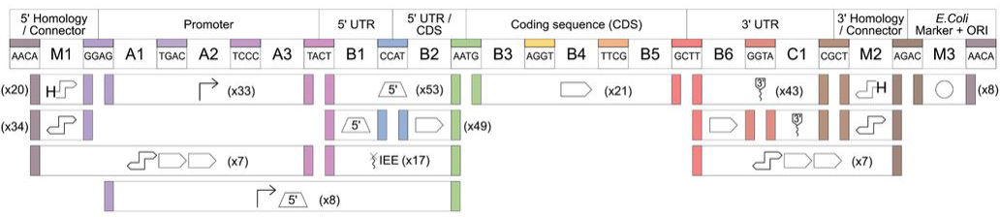

# LVL-0 GoldenGate Parts

## Overview

## Nomenclature
| Nomenclature | Position | Part Type | Description | Left Overhang | Right Overhang | 
|--------------|----------|-----------|-------------|---------------|----------------|
| pME_Cp_0_1 | 1 | XXX | XXX | XXX | XXX | 
| pME_Cp_0_2 | 2 | Promoter | XXX | XXX | XXX |
| pME_Cp_0_2-3 | 2-3 | XXX | XXX | XXX | XXX |
| pME_Cp_0_3 | 3 | 5'UTR | XXX | XXX | XXX |
| pME_Cp_0_3_IEE | 1 | IEE | XXX | XXX | XXX |
| pME_Cp_0_3a | 1 | XXX | XXX | XXX | XXX |
| pME_Cp_0_3b | 1 | XXX | XXX | XXX | XXX |
| pME_Cp_0_4 | 1 | CDS | XXX | XXX | XXX |
| pME_Cp_0_5 | 1 | 3'UTR | XXX | XXX | XXX |
| pME_Cp_0_5a | 1 | XXX | XXX | XXX | XXX |
| pME_Cp_0_5b | 1 | XXX | XXX | XXX | XXX |
| pME_Cp_0_6 | 1 | XXX | XXX | XXX | XXX |
| pME_Cp_0_7-8 | 1 | XXX | XXX | XXX | XXX |